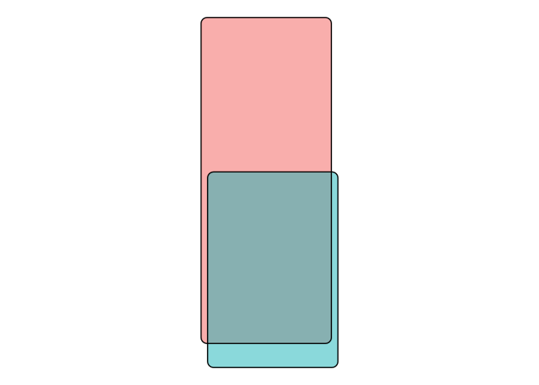

<!-- README.md is generated from README.Rmd. Please edit that file -->

# setreuler

<!-- badges: start -->
<!-- badges: end -->

The goal of setreuler is to draw boxy Euler diagrams.

## Installation

You can install the development version from
[GitHub](https://github.com/) with:

``` r
# install.packages("devtools")
devtools::install_github("kylebittinger/setreuler")
```

## Example

This is a basic example which shows you how to solve a common problem:

``` r
library(tidyverse)
#> ── Attaching packages ─────────────────────────────────────── tidyverse 1.3.1 ──
#> ✓ ggplot2 3.3.5     ✓ purrr   0.3.4
#> ✓ tibble  3.1.3     ✓ dplyr   1.0.7
#> ✓ tidyr   1.1.3     ✓ stringr 1.4.0
#> ✓ readr   2.0.1     ✓ forcats 0.5.1
#> ── Conflicts ────────────────────────────────────────── tidyverse_conflicts() ──
#> x readr::edition_get()   masks testthat::edition_get()
#> x dplyr::filter()        masks stats::filter()
#> x purrr::is_null()       masks testthat::is_null()
#> x dplyr::lag()           masks stats::lag()
#> x readr::local_edition() masks testthat::local_edition()
#> x dplyr::matches()       masks tidyr::matches(), testthat::matches()

in_a <- rep(c(T, F), c(10, 1))
in_b <- rep(c(F, T), c(5, 6))

d <- tibble::tibble(
  label = LETTERS[1:11],
  setA = in_a,
  setB = in_b)

d_coords <- d %>%
  summarize(setreuler_coordinates(setA, setB, offset = 0.1, width = 2))

r <- grid::unit(2, "mm")
```

``` r
d_coords %>%
  ggplot(aes(x = x, y = y, group = group)) +
  ggforce::geom_shape(aes(fill = group), alpha = 0.5, radius = r) +
  ggforce::geom_shape(color = "black", fill = NA, radius = r) +
  coord_equal() +
  theme_void()
```


